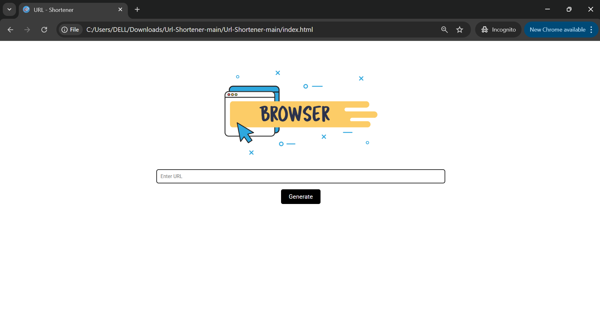
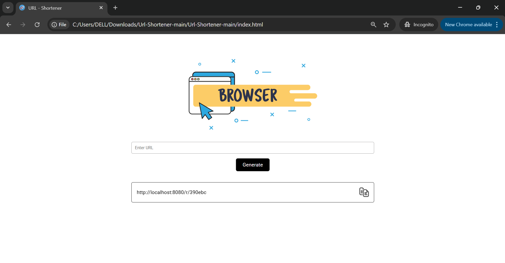

🧩 1. Import Maven Project
STS/Eclipse
  Go to: File → Import → Existing Maven Projects

📂 Select your project location
  Click Next → Finish

🧪 2. Check Java Version
Make sure you are using a compatible JDK.

📦 3. Add Dependencies in pom.xml
Add any required dependencies (like SLF4J, H2, etc.) to the <dependencies> section.
  <dependency>
    <groupId>org.slf4j</groupId>
    <artifactId>slf4j-api</artifactId>
    <version>1.7.36</version>
  </dependency>

⚙️ 4. Maven Build Lifecycle
Run the following in order:
  🔄 Right-click project → Maven → Update Project
  🧹 Right-click project → Run As → Maven clean
  ✅ Run As → Maven clean test
  🏗️ Run As → Maven install

▶️ 5. Run the Project
  Open the entry point:
  src/main/java/server/Main.java
  Right-click on Main.java → Run As → Java Application

🛠️ 6. Add Run Configuration
  Go to: Run → Run Configurations...
  Select Java Application
  Click New Launch Configuration
  Settings:
    🏷️ Project: url-shortener-app
    🧑‍💻 Main class: server.Main
    ⚙️ VM arguments:
      -Xmx64m -Xms32m
      Click Apply → Run

